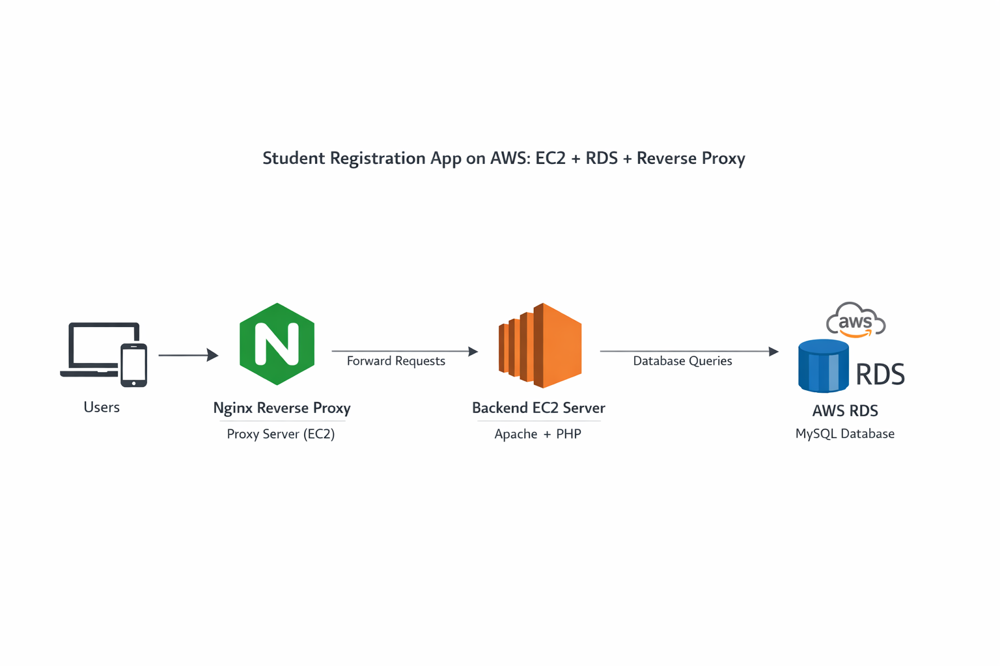
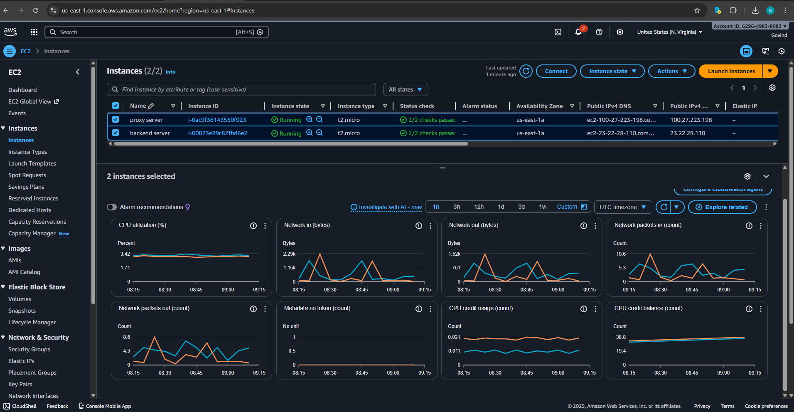
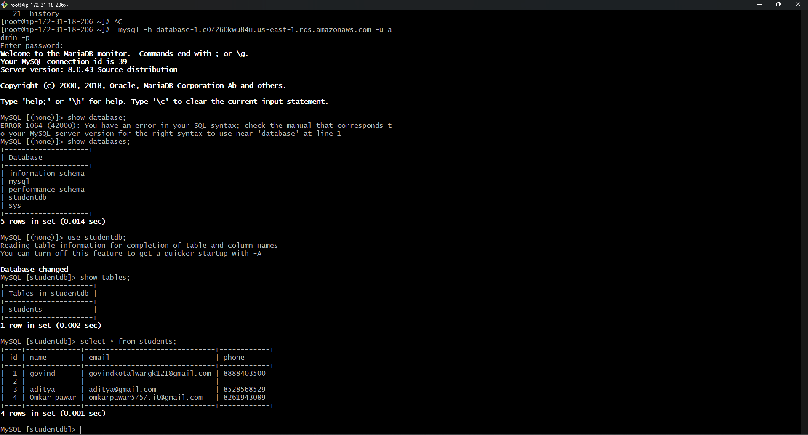
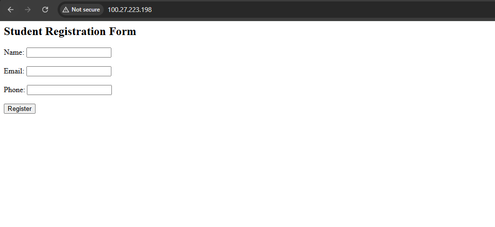

# Student Registration Application on AWS (EC2 + RDS + Reverse Proxy)

This project is a simple Student Registration web application hosted on AWS. The application runs on an EC2 instance with Apache and PHP, stores student data in an AWS RDS MySQL database, and is accessed through an Nginx reverse proxy server.

It is designed as a learning and demonstration project for understanding how to integrate compute, database, and networking services on AWS.

---

## Architecture

User → Nginx Reverse Proxy (EC2) → Backend EC2 (Apache + PHP) → AWS RDS (MySQL)

---

## Features

* Student Registration form with Name, Email, and Phone fields
* Stores form data in AWS RDS MySQL database
* Backend application hosted on Apache Web Server
* Reverse proxy configured using Nginx
* Simple, modular and easy-to-understand setup

---

## Technologies Used

* AWS EC2
* AWS RDS (MySQL)
* Apache Web Server
* PHP
* Nginx Reverse Proxy
* Amazon Linux

---

### Architecture Diagram



### Backend EC2 Server



### Student Registration Form


### Data Stored in Database



### Reverse Proxy Working



---

## Setup Guide

### 1. Create AWS RDS MySQL Database

1. Create an RDS MySQL instance
2. Enable public access (only for learning/testing)
3. Allow inbound port `3306` in the security group
4. Note down the RDS endpoint

Create the database and table:

```
CREATE DATABASE studentdb;
USE studentdb;

CREATE TABLE students(
 id INT AUTO_INCREMENT PRIMARY KEY,
 name VARCHAR(50),
 email VARCHAR(50),
 phone VARCHAR(15)
);
```

---

### 2. Configure Backend EC2 Server

Install Apache and PHP:

```
sudo yum install httpd php php-mysqli -y
sudo systemctl start httpd
sudo systemctl enable httpd
```

Place the backend files in `/var/www/html/`

* index.php – Student Registration Form
* save.php – Handles database insert operations

Test the application using the backend EC2 public IP.

---

### 3. (Optional) Install MySQL Client on EC2

```
sudo dnf install mariadb -y
mysql -h <rds-endpoint> -u admin -p
```

Verify data:

```
SELECT * FROM students;
```

---

### 4. Configure Reverse Proxy Server

Launch another EC2 instance for proxy. Install Nginx:

```
sudo dnf install nginx -y
sudo systemctl enable nginx
sudo systemctl start nginx
```

Configure reverse proxy to forward traffic to backend EC2:

```
proxy_pass http://<backend-ec2-ip>;
```

Restart nginx:

```
sudo systemctl restart nginx
```

Access the application using the proxy server public IP.

---

## Testing

1. Open the proxy EC2 public IP in a browser
2. Fill out the registration form
3. Submit the form
4. Verify data in the database using MySQL client

---

## Security Considerations

This setup is created for learning and demonstration purposes.
For production environments:

* Do not keep RDS publicly accessible
* Use private subnets and proper networking
* Restrict security groups
* Configure HTTPS
* Use AWS Secrets Manager instead of hardcoding credentials

---


